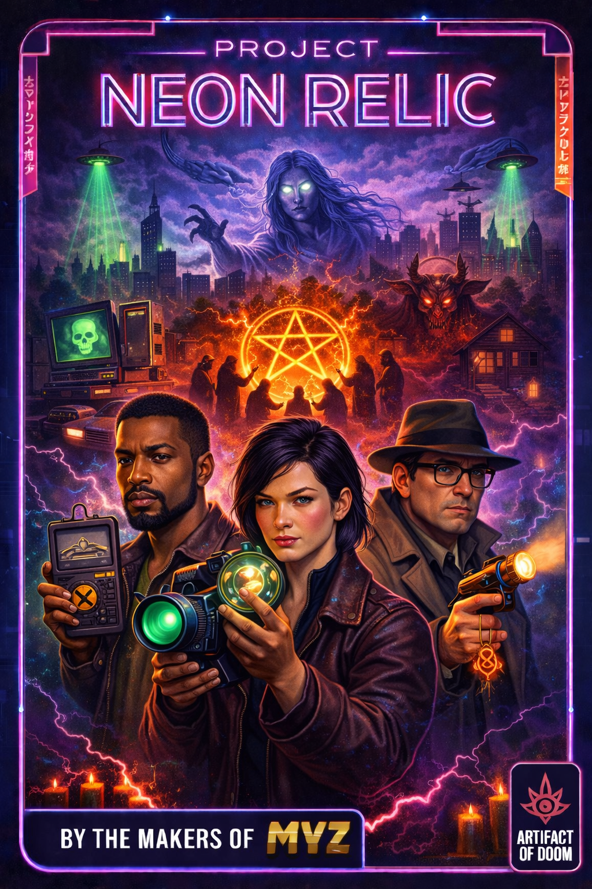

= Project Neon Relic
Bruce; Stu
:doctype: book
:toc: left
:toclevels: 3
:front-cover-image: 
:sectnums:
:sectnumlevels: 2
:icons: font
:source-highlighter: rouge
:pdf-theme: neon-relic
:pdf-themesdir: {docdir}/themes
:imagesdir: {docdir}/../assets

[.lead]
_"What is found must be known. What is known must be contained. What is contained must be guarded."_

— _The Oath of the Verdant Covenant_

include::chapters/01-introduction.adoc[leveloffset=+1]

include::chapters/02-verdant-covenant.adoc[leveloffset=+1]

include::chapters/03-setting.adoc[leveloffset=+1]

include::chapters/03b-combat.adoc[leveloffset=+1]

include::chapters/04-core-mechanics.adoc[leveloffset=+1]

include::chapters/05-attributes-skills.adoc[leveloffset=+1]

include::chapters/05b-social-conflict.adoc[leveloffset=+1]

include::chapters/06-health-damage-armor.adoc[leveloffset=+1]

include::chapters/07-resonance-corruption.adoc[leveloffset=+1]

include::chapters/08-healing.adoc[leveloffset=+1]

include::chapters/09-divisions.adoc[leveloffset=+1]

include::chapters/10-advancement.adoc[leveloffset=+1]

include::chapters/11-equipment.adoc[leveloffset=+1]

include::chapters/12-artifacts.adoc[leveloffset=+1]

include::chapters/13-case-file.adoc[leveloffset=+1]

include::chapters/14-headquarters.adoc[leveloffset=+1]

include::chapters/15-rival-factions.adoc[leveloffset=+1]

include::chapters/16-notable-members.adoc[leveloffset=+1]

include::chapters/17-bestiary.adoc[leveloffset=+1]
